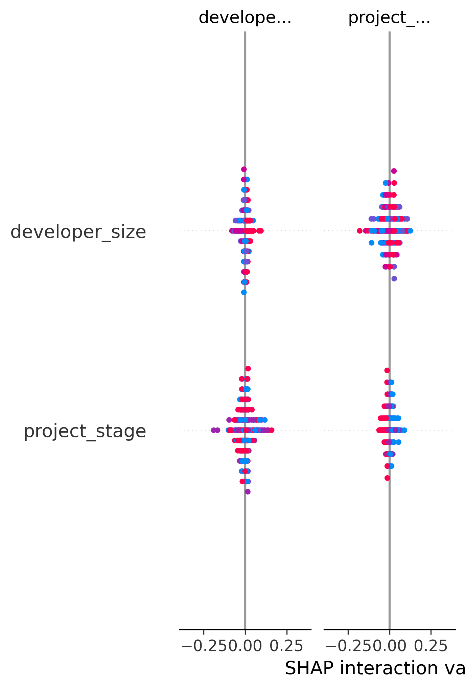

# Sales-Lead-Scoring-Model-for-Offshore-Wind-Developers
This project focuses on identifying high-value customers using machine learning.  What makes it different is that I didn’t stop at model accuracy. I used SHAP to interpret the model and understand the drivers behind predictions.  I found that purchase frequency plays a much more important role than transaction size.  
This challenges a common business assumption and suggests that companies should focus more on customer engagement and retention.
This project demonstrates my ability to combine machine learning with business thinking to generate actionable insights.
This project shows that the value of machine learning is not just prediction accuracy, but the ability to generate actionable business insights.
# Sales Lead Scoring Model for Offshore Wind Developers

## 🌍 Business Context

In offshore wind development, companies must decide which clients to prioritize due to limited sales resources.

This project simulates a real-world scenario where an energy data company uses machine learning to identify developers most likely to purchase data.

---

## 🎯 Objective

* Predict which offshore wind developers are most likely to buy data
* Help sales teams prioritize high-value leads

---

## ⚙️ Methodology

* Built a Random Forest classification model
* Achieved ~85% accuracy
* Applied SHAP for model interpretability

---

## 🔍 Key Insights

* Project stage is a major driver (late-stage projects are more likely to buy)
* Budget level strongly influences purchasing decisions
* Relationship strength significantly impacts conversion
* Active tenders increase likelihood of purchase

---

## 💡 Business Recommendations

* Focus on late-stage offshore wind projects
* Prioritize developers with strong budgets
* Invest in long-term relationship building
* Track tender activity as a key signal

---

## 📊 Model Interpretation

---

## 🧠 Key Takeaway

Machine learning is not just about prediction — it enables smarter sales decisions and resource allocation.
